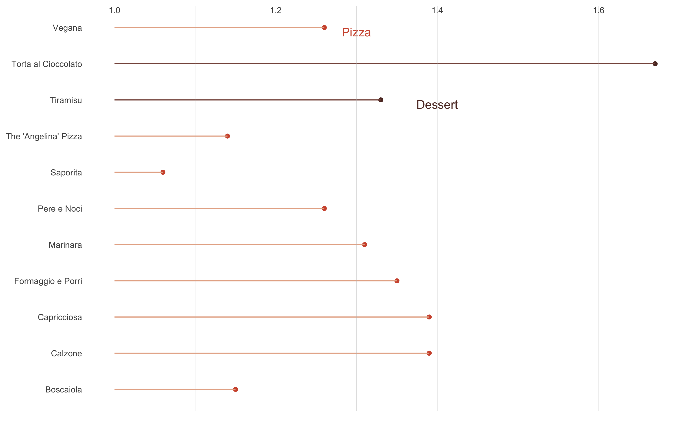

<h1>Doordash Delivery:
  Are My Pizzas Getting More Expensive?</h1>

Author: Nicole Golden  Date: April 22, 2022 

Yes, inflation is here. As someone who has to order take-out food weekly, I definitely felt the pinch since the lockdown in 2020. So I collected food prices from my favorite pizza place in Irvine for this project. First, I used smooth lines to visualize the evolution of the price changes for all pizzas and desserts. Then I plot the price changes for each food item.
  
(You can find the data and code on my <a hrf="https://github.com/NicoleGolden/Restaurant_project" target=_blank>GitHub</a> page.)

<h3> Data</h3>

he data comes from my Doordash order record. Since pizza and dessert are the most ordered food types, I only made plots for these two types. In addition, I included food that was ordered more than once.
The main variables are purchase date and the average prices for pizza or dessert for that purchase date.

<h3> Behold: How Much Have The Prices Increased since Lockdown in 2020?</h3>

I plotted with raw data first.

<h6>Figure 1 - Average Price Changes Over Time for Pizza and Dessert(Raw Data) (Image Source: Nicole Golden. Data Source: <a href=https://www.doordash.com/ target=_blank>Doordash</a>)

Then I plotted with smoothed lines and indicated the price changes. The price increase is about 66% for the pizza and a 33% increase for dessert!

<h6>Figure 2: Average Price Changes Over Time for Pizza and Dessert
(with Smoothed Lines)
(Image Source: Nicole Golden. Data Source: <a href=https://www.doordash.com/ target=_blank>Doordash</a>)

<h3> Take A Look At Price Change for Each Food Item</h3>
I thought it might be interesting to look at the price change for each food item. So I standardized the original price to 1, and I normalized the new price by dividing the latest price by the beginning price.
  
(Spoiler alert: "Pere e Noci" is my favorite pizza! Because its absolute price and percentage change are not that crazy, I almost always order this one!)

Here comes the plot!

<h6>Figure 3: Price Changes For Each Food Item
(Image Source: Nicole Golden. Data Source:<a href=https://www.doordash.com/ target=_blank>Doordash</a>)

