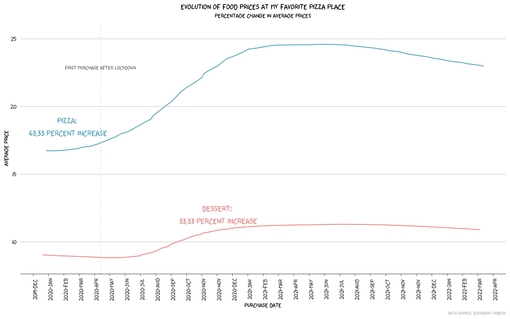

## Evolution of Food Prices at My Fav Pizza Place

Yes, inflation is here. As someone who has to order take-out food weekly, I defenitely feel the pinch since the lockdown in 2020. In this project, I collected food prices from my favoriate pizza place in Irvine. I used smooth lines to visualize the evolution of the price changes. 

## Data 

The data comes from my Doordash order record. Since pizza and dessert are the most ordered food types, I only made plots for these two types. In addition, I included food that was ordered more than once. 

The main variables are purchase date and the average prices for pizza or dessert for that purchase date. 

## Behold: How Much Have The Prices Increased since Lockdown in 2020? 

I plotted with raw data first. 

Figure 1: Price Changes Over Time (Raw Data)

Then I plotted with smoothed lines and indicated the price changes. For the pizza, the price increase is about 66%, and 33% increase for dessert!

Figure 2: Price Changes Over Time (Use Smooth Lines)

## Take A Look At Price Change for Each Food Item 

I think it might be intersting to take a look at price change for each food item. I standardized original price to 1, and divide the new price with original price. 
(Spoiler alert: "Pere e Noci" is my favorite pizza! Because its absolute price and percentage change are not that crazy, I almost always order this one!)

